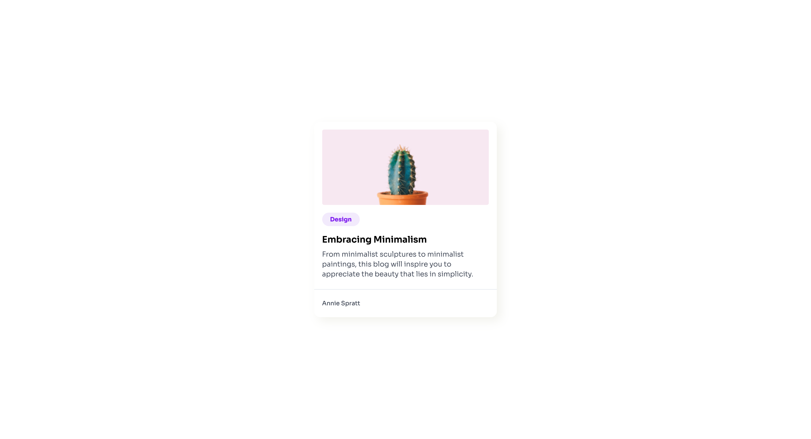

<h1 align="center"> Minimal Blog Card | devChallenges</h1>

   Solution for a challenge <a href="https://devchallenges.io/challenge/minimal-blog-card" target="_blank">Minimal Blog Card</a> from <a href="http://devchallenges.io" target="_blank">devChallenges.io</a>.

  <h3>
    <a href="{https://your-demo-link.your-domain}">
      Demo
    </a>
     | 
    <a href="{https://your-url-to-the-solution}">
      Solution
    </a>
     | 
    <a href="https://devchallenges.io/challenge/minimal-blog-card">
      Challenge
    </a>
  </h3>

<!-- TABLE OF CONTENTS -->

## Table of Contents

- [Table of Contents](#table-of-contents)
- [Overview](#overview)
  - [What I learned](#what-i-learned)
  - [Useful resources](#useful-resources)
  - [Built with](#built-with)
- [Author](#author)

<!-- OVERVIEW -->

## Overview

### What I learned

I learned new ways to work on projects, and more on this new platform.

### Useful resources

- [Google Fonts](https://fonts.google.com/) - This helped me to use external fonts instead of local ones, so that everyone can identify the type of font I used for this challenge.

### Built with

- Semantic HTML5 markup
- CSS custom properties
- Flexbox
- CSS Grid
- [React](https://reactjs.org/)
- [Tailwind](https://tailwindcss.com/)

This application/site was created as a submission to a [DevChallenges](https://devchallenges.io/challenges-dashboard) challenge.

## Author

- GitHub [@AlexanderTejedor](https://github.com/AlexanderTejedor?tab=repositories})
